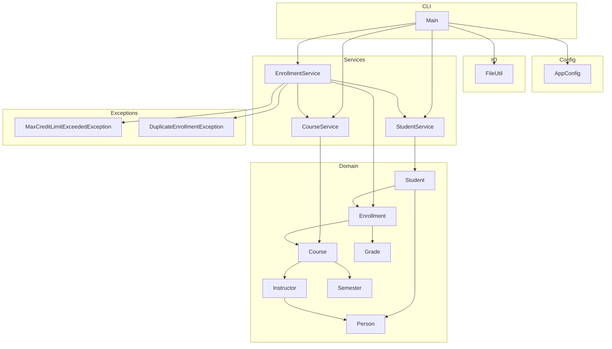

    

    <b>Automatic Architecture Diagrams from Code</b> 
    <a href="https://github.com/swark-io/swark">GitHub</a> • <a href="https://swark.io">Website</a> • <a href="mailto:contact@swark.io">Contact Us</a>

## Usage Instructions

1. **Render the Diagram**: Use the links below to open it in Mermaid Live Editor, or install the [Mermaid Support](https://marketplace.visualstudio.com/items?itemName=bierner.markdown-mermaid) extension.
2. **Recommended Model**: If available for you, use `claude-3.5-sonnet` [language model](vscode://settings/swark.languageModel). It can process more files and generates better diagrams.
3. **Iterate for Best Results**: Language models are non-deterministic. Generate the diagram multiple times and choose the best result.

## Generated Content
**Model**: GPT-4o - [Change Model](vscode://settings/swark.languageModel)  
**Mermaid Live Editor**: [View](https://mermaid.live/view#pako:eNqNVMtuwyAQ_BWLc_IDPlSq7LSKlKqV0t64ULNJkDBYsFSpovx7SUkMJriqb8zMso9ZfCKd5kBqQtXesOFQvbdUVf6z7jMAzWYdkMv3woQKJ1Ccqlyq1U7so_pxGFKoFLJ-jfInIeEDhZxXb8F8iQ5sjFkpo6XsQeGVi1SjnbFwB2_R8VxeytXqfmw2icvvL5USsbWyaFyH2kTsDYzVycXPhvG0PujBIpj5ylbHDgYUWtnUmGNjgAvciF7gRQEc-KiMwtYNUnQMIZabqZKUF7ur5fIhd3LEp5aN8IwrI1-wZuRyfwJ9d2NRO68sZCwLcxfLqn-Nuxz6twEhctpX2mrgJ90k_d1Pa0IWqOvyTdIW55Bytw0OTNzxCRnr_IXzl5BQcePJgvRg_Lvj_o90ogQPnqKkrijhsGNOIiVnL3ID9wNsBfMPoie1vxgWhDnU22_V3c5Gu_2B1DsmLZx_AGIKmFA) | [Edit](https://mermaid.live/edit#pako:eNqNVMtuwyAQ_BWLc_IDPlSq7LSKlKqV0t64ULNJkDBYsFSpovx7SUkMJriqb8zMso9ZfCKd5kBqQtXesOFQvbdUVf6z7jMAzWYdkMv3woQKJ1Ccqlyq1U7so_pxGFKoFLJ-jfInIeEDhZxXb8F8iQ5sjFkpo6XsQeGVi1SjnbFwB2_R8VxeytXqfmw2icvvL5USsbWyaFyH2kTsDYzVycXPhvG0PujBIpj5ylbHDgYUWtnUmGNjgAvciF7gRQEc-KiMwtYNUnQMIZabqZKUF7ur5fIhd3LEp5aN8IwrI1-wZuRyfwJ9d2NRO68sZCwLcxfLqn-Nuxz6twEhctpX2mrgJ90k_d1Pa0IWqOvyTdIW55Bytw0OTNzxCRnr_IXzl5BQcePJgvRg_Lvj_o90ogQPnqKkrijhsGNOIiVnL3ID9wNsBfMPoie1vxgWhDnU22_V3c5Gu_2B1DsmLZx_AGIKmFA)

